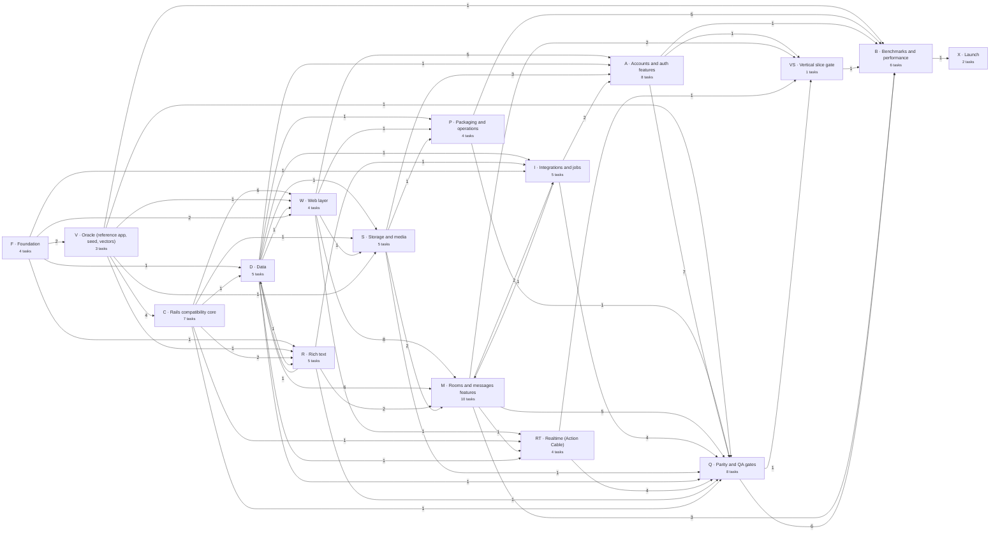

# Porting Campfire to C#

Status: in progress, run by a local multi-vendor swarm (`plans/bin/plan ready` and
`plans/bin/swarm status` show where it stands)
Target repo: `ryanrodemoyer/once-campfire-csharp`
Oracle: Rails `basecamp/once-campfire@345e637` (submodule `reference/`)
Secondary reference and tooling: `basecamp/once-campfire-rust@ccece30` (submodule `reference-rust/`)

Companion files:

- [`tasks.yaml`](tasks.yaml): the task graph (scope, dependencies, file ownership, acceptance)
- [`dag.md`](dag.md): the generated DAG, critical path, waves and swarm sizing
- [`bin/plan`](bin/plan): validates the graph and tells an agent what to pick up next
- [`swarm.yaml`](swarm.yaml) and [`bin/swarm`](bin/swarm): who runs what, and the local dispatcher
- [`status/`](status/): one file per finished task

## Goal

A C# implementation of Campfire that behaves the same as the Rails app on the same SQLite database,
storage directory, cookies, URLs and frontend, and that can be benchmarked fairly next to the
Rails, Django, Laravel, Express, Elixir, Go and Rust columns in the upstream README.

"Fairly" means the same rules the Go and Rust ports follow:

- **Never benchmark an incomplete response.** Every measured response is checked against the
  reference for that exact request before it counts. A page that skips work Rails does is a bug,
  not a speedup.
- **Same seed, same harness, same box.** The README numbers came from one AMD Ryzen AI MAX+ 395,
  four hardware threads per app, 16 concurrent clients. Our numbers are only comparable if Rails is
  measured on the same machine in the same run.
- **Differences are written down.** Anything that isn't at parity goes in the README's known
  differences with the failing gate linked, like the Go port does.

## Non-goals

- Redesigning or "improving" anything. Any visible or behavioral difference is a bug.
- Rewriting the frontend. JS, CSS, Turbo, Stimulus and Lexxy ship byte for byte.
- Databases other than SQLite.
- Live cutover. Rails→C# is an offline upgrade, and jobs are best-effort, as DHH decided for the
  Rust port.

## What we're porting

| Layer | Size in the reference | Strategy |
|---|---|---|
| Ruby (models, controllers, helpers, jobs, channels, lib) | ~3,700 LOC, 128 files | Rewrite against golden vectors |
| ERB/Jbuilder views | ~2,200 LOC, 89 files | One template per file, same relative path |
| JavaScript and CSS | ~3,700 + ~3,400 LOC | Copy verbatim |
| Vendored JS (Turbo, Stimulus, Lexxy, Action Cable, request.js, highlight.js) | — | Copy from the gem versions in `Gemfile.lock` |

Lines of Ruby understate the work. Most of the effort is the Rails behavior the app relies on
implicitly: cookie signing, CSRF, params, sanitizing, Active Storage, Action Cable, view-helper
output. For calibration, the Go port is ~26k lines plus ~4.4k of tests, and the Rust port is ~71k.
We should expect 25–35k lines of C#.

## Compatibility contracts

These are the same contracts the Rust port catalogued. Read
[`reference-rust/plans/rust-conversion.md`](https://github.com/basecamp/once-campfire-rust/blob/main/plans/rust-conversion.md)
for the detail, which still applies. In short:

- **Signing and sessions**: `session_token` signed cookie, `_campfire_session` encrypted cookie,
  CSRF (masked tokens, header, Origin), signed IDs, SGIDs including the User-only invalid-signature
  fallback, and Turbo signed stream names. Ported against golden vectors, in both directions. (C01–C04)
- **Persisted data**: STI names, enum integers, polymorphic types, timestamp format, JSON columns,
  callback side effects in the same order and transactions, and SQLite settings. Rails must boot on
  C#-written data. (D01–D03, Q03)
- **Active Storage**: disk layout, checksums, signed URLs, variant digests (SHA1 of a Ruby Marshal
  dump), reuse of existing variant records, and byte-identical media from a pinned libvips and ffmpeg. (S01–S03, S05)
- **Rich text**: the three content filters, then the Action Text sanitizer and auto_link, the edit
  round trip and plain-text extraction. This is the highest security risk. (R01–R05)
- **Real time**: the Action Cable protocol, the stock Turbo channel with the room-stream guard, and
  revocation on membership removal, deactivation and ban. (RT01–RT04)
- **HTTP clients**: three policies, never one shared client. Opengraph and Web Push are restricted
  and IP-pinned. Webhooks are deliberately unrestricted. (I02–I05)
- **Requests**: Rails nested params, `_method`, format negotiation, Turbo Frames, custom message
  pagination, the bot API's raw bodies and headers, conditional GET. (C05, W01, W02, D05, I05)

The oracle rule: we port each contract against output generated by the reference app, never from
our reading of the docs. Security properties are also asserted independently, because two
implementations can agree on something unsafe.

## Stack

| Concern | Choice | Why |
|---|---|---|
| Runtime | .NET 10 LTS | Current LTS; Dynamic PGO and Native AOT are both options for the benchmark (B04) |
| HTTP | Kestrel with a raw `RequestDelegate` | Fastest path in ASP.NET Core; MVC and minimal-API binding add cost and fight Rails semantics |
| Routing | Our own ordered router generated from `campfire_routes.json` | Rails matches routes in declaration order (first match wins); ASP.NET Core's precedence-based routing would resolve some routes differently. The Go port also kept 177 ordered route contracts |
| Controllers | Plain classes; explicit before-action chains | Same reason as the Rust port: middleware stacks don't reproduce `only:`/`except:`/skip semantics |
| Templates | Erubi-compatible source generator (W04); RazorSlices fallback | See [Templates](#templates) |
| Database | Microsoft.Data.Sqlite + bundled SQLite with FTS5, hand-written SQL, one writer plus a reader pool | An ORM would fight Rails' conventions and cost throughput; the Rust and Go ports made the same call |
| JSON | System.Text.Json source generation | Allocation-light and AOT-safe |
| HTML parsing | AngleSharp, or a port of the Go port's tree builder if AngleSharp's tree diverges from Nokogiri | The serializer is ours either way (R01) |
| Crypto | BCL only (`Rfc2898DeriveBytes.Pbkdf2`, `HMAC*`, `AesGcm`, `ECDsa`, `ECDiffieHellman`, `HKDF`) plus BCrypt.Net-Next | Everything Rails and Web Push need is in the box |
| WebSockets | Kestrel's built-in WebSockets, with the Action Cable protocol in our own code | Supports permessage-deflate |
| Images and video | NetVips over the pinned libvips 8.16.1; ffmpeg 7.1.5 as a subprocess | Same libraries as Rails, which makes byte-identical variants possible |
| Front server | Thruster first, native Kestrel TLS/ACME/HTTP2 later (P03) | Thruster is a standalone binary, so we get ONCE-compatible TLS on day one; benchmarks bypass it anyway |
| Tests | xUnit v3, tests beside each project; Playwright for screens and workflows | — |

### Templates

The Go port's biggest remaining parity gap is whitespace and attribute serialization from
`html/template`. We avoid that by construction. W04 builds a small source generator that compiles
ERB-syntax templates, with C# expressions in place of Ruby, using **Erubi's exact trim rules**.
Each `.html.erb` file becomes a `.html.erb.cs`-style template at the same relative path. The
markup is copied unchanged and only the `<% %>` contents are translated. The output is a method
writing UTF-8 into an `IBufferWriter<byte>`, with no reflection and AOT-safe. This makes every
template translation a mechanical, reviewable diff against its ERB source, which is ideal for a
swarm.

If the W04 spike fails its whitespace corpus, we fall back to RazorSlices and budget for
normalization differences, as Go did. VS01 is where we confirm or revise this choice with
evidence.

## Repository layout

```
reference/                  Rails oracle (submodule, never edited)
reference-rust/             Rust port: vectors, seed tools, parity and bench harness (submodule)
vectors/  reference-tools/  Imported golden vectors and their generators (V03)
assets/                     Frontend, byte-identical to the reference (F04)
src/
  Campfire.RailsCompat/     Crypto, cookies, CSRF, GlobalID, params, Ruby formatting, UA (C*)
  Campfire.Data/            SQLite, records, lifecycle, search, pagination (D*)
  Campfire.RichText/        Parse/serialize, sanitize, attachments, plain text (R*)
  Campfire.Storage/         Active Storage, variants, media (S*)
  Campfire.Templates*/      Erubi-compatible template compiler (W04)
  Campfire.Cable/           Action Cable server, Turbo channel, app channels (RT*)
  Campfire.Jobs/            Job runner, Web Push, opengraph, webhooks, restricted HTTP (I*)
  Campfire.Web/             Router, pipeline, helpers, controllers, views (W*, A*, M*)
  Campfire.Server/          Program, CLI, front server (P*)
tests/                      One test project per src project, plus fuzz and workflows
parity/                     Reference runner, seed, replay, state, screens, cable (V*, Q*)
bench/                      Harness integration and raw results (B*)
plans/                      This plan, the task graph, status records
```

Dependencies only point one way: RailsCompat ← Data ← RichText/Storage ← Cable/Jobs ← Web ← Server.

## Milestones

| Milestone | Exit criterion |
|---|---|
| **M0 Foundation** | Repo restructured, solution builds in CI, reference runs, seed and vectors in place, template compiler spike done |
| **M1 Vertical slice** (VS01) | A Rails-issued cookie authenticates on C#, the room renders, a post broadcasts to a second user, and Rails boots on the C#-written DB and edits, deletes and searches that message |
| **M2 Benchmark five** (B02) | Room, messages, sidebar, search and post replay-equal to the reference; first **internal** numbers next to Rails on the same box |
| **M3 Feature complete** (Q02) | Every route implemented; no 501 stubs |
| **M4 Parity green** | Screens, cable replay, continuity, workflows, rich-text fuzzing and security review all pass |
| **M5 Published** | Perf round done, final run on reference-class hardware, README written, upstream PR and announcement |

M2 is the first point at which numbers mean anything. Don't share numbers before B02, and don't
share them publicly before B05.

## The DAG

The full graph is in [`dag.md`](dag.md). It's generated, so run `plans/bin/plan dag` after editing
`tasks.yaml`. The shape, at the time of writing:

- **81 tasks, 178 dependencies, 16 lanes.** M10 (message attachments) was split out of M05 and is
  a dependency of Q02, since Q02 requires every route to be implemented.
- **Remaining critical paths** (as of 2026-10-09, with 62 tasks merged):
  `M10 → Q02 → B03 → B05 → X01 → X02` and `RT04 → Q04/Q05/Q07/Q08 → B05`.
- **Path to first benchmark numbers**: `VS01 → B02`.
- **Swarm sizing**: the remaining graph is about four chains wide. Four agents with two slots
  each run every ready task at once; a second slot shares its CLI's quota. The original sizing (8 agents for the full 79-task graph) no longer applies.

Lane overview, a snapshot of the generated one in dag.md (edge labels count cross-lane task dependencies):



## Running the swarm

### Picking up work

```sh
plans/bin/plan ready        # claimable tasks, highest critical-path priority first
plans/bin/plan show R01     # full task card: deliverables, refs, acceptance, dependents
```

A task is claimable when every dependency has a `plans/status/<ID>.md` on `main`. Every task has a
GitHub issue (#1–#79, mapped in [`issues.json`](issues.json)), with its acceptance criteria as a
checklist and labels for lane, milestone, size, `bench` and `human`. An agent claims a task by
assigning its issue to itself or commenting that it has started.

### Merging without a human in the loop

One task is one PR, and PRs merge themselves:

- `main` is protected: merging requires `bin/check` (and, once they exist, the replay gates) to pass,
  but not a human approval.
- Each agent opens its PR with `Closes #<issue>` and turns on auto-merge (squash). A green PR
  merges itself, which closes the issue and unblocks its dependents.
- A red PR stays with its agent until it is green; a conflicted PR merges `main` in. Nobody waits
  on a person.
- Only issues labelled `human` need a person: B05 (the final benchmark needs real hardware) and
  X02 (anything public under the owner's name). The orchestrator never assigns those.
- F01–F03 come before CI exists, so they're reviewed and merged by the owner once; everything after
  them is gated by CI instead.

### Rules for every agent

1. **One task, one branch, one PR**: `port/<ID>-<slug>` off `main`, PR title `[<ID>] <title>`.
2. **Stay inside `owns`.** If you need a change in a path another task owns, open an issue
   against that task (or a follow-up task) instead of editing it. The shared registries are built
   up front so that features only fill in:
   - W01 generates the **complete route table**, with every handler stubbed to 501.
   - D02 defines **every record type**.
   - D03 defines the **seams** `IBroadcaster`, `IJobQueue` and `IConnectionRevoker`, with in-memory
     fakes, so the M, RT and I lanes never wait on each other.
   - W03 provides the helpers; each feature task owns its own controllers and views.
3. **Never edit `reference/` or `reference-rust/`.**
4. **Oracle first.** Expected output comes from the reference: vectors, replay, golden helper
   output. Hand-written expectations are only for independent security assertions.
5. **Tests beside code.** Port the relevant `reference/test` cases. Run controller tests with CSRF
   **on**, since Rails' test env turns it off.
6. **Done means**: `bin/check` is green, every acceptance criterion has evidence in
   `plans/status/<ID>.md`, and the PR is merged. Once Q01 exists, feature PRs also attach the
   replay result for their route family.
7. **Never benchmark** anything before B02, and never publish numbers before B05.
8. **Stage files by path.** Never `git add -A` or `git add .`; worktrees hold local secrets and
   scratch files (`tmp/` is ignored, but don't rely on it).
9. **Security work is reviewed across vendors.** Whoever writes R04 or RT04 doesn't do Q08, and
   the Q08 reviewer is a model from a different vendor, so two implementations can't agree on
   the same unsafe behavior.

### Orchestrator

The swarm runs locally on the owner's machine (16 hardware threads, Docker). There are five
workers, each a different model. The assignments are in [`swarm.yaml`](swarm.yaml):

| Worker | CLI and model | Queue | Points |
|---|---|---|---|
| `claude` | Claude Code, Opus 5.5 (medium; high on R04 and RT04) | R04, RT04, B03, X01 | 9 |
| `gemini` | Antigravity, Gemini 3.8 Flash (high) | M09, Q06, Q02, Q07, Q05 | 8 |
| `grok` | Grok CLI, Grok 4.7 (high) | VS01, B06, B02, B04, Q08 | 7 |
| `glm` | OpenCode, GLM 5.3 (high) | M10, P02, Q04 | 8 |
| `deepseek` | OpenCode, DeepSeek V4.1 Flash | Q09 | 1 |

Queues are balanced by size (S=1, M=2, L=4 points) and keep each dependency chain with one worker.
Claude takes the security-critical R04 and RT04; Grok reviews them in Q08.

`plans/bin/swarm run` is the orchestrator. Every `poll_seconds` it:

1. **Stops dispatching if paused**: when `.swarm/PAUSE` exists or any open issue carries
   `pause-swarm`. Running workers carry on.
2. **Reconciles work in flight**, using `origin/main`, open PRs and the worker processes:
   - removes the worktree of every task whose status file has landed on `main`;
   - turns on auto-merge for PRs that don't have it;
   - sends a red or conflicted PR back to its own worker before that worker takes new work;
   - retries a task whose worker exited without a PR, after `retry_after_minutes` (45) so a quota
     or rate limit has time to clear. After `max_attempts` (3) it labels the issue `needs-human`
     and stops retrying.
3. **Dispatches** each worker the first ready tasks in its queue, up to its `slots` (2). Each
   task gets a worktree at `../campfire-wt/<ID>` on `port/<ID>-<slug>`, branched from
   `origin/main` (never the local `main`), with submodules checked out. The worker gets the task
   card, the rules in `AGENTS.md`, and instructions to see its PR through to merge. The issue
   gets `in-progress`, an `agent:<name>` label and a "Claimed by local swarm worker" comment.
4. **Protects measurements.** B02, B03 and B04 are `exclusive`. When one is ready, nothing new
   starts until the machine is idle, and nothing else starts while it runs.
5. **Rewrites the dashboard**, `.swarm/dashboard.html`, which shows each worker's current task,
   log tail and queue, a graph of the remaining work colored by state, and an event log. It
   refreshes itself every 30 seconds.

`plans/bin/swarm smoke` checks that every CLI can run headless and use a shell tool before you
start. `plans/bin/swarm status` prints the same state as the dashboard without dispatching.
Worker logs are in `.swarm/logs/<ID>-<attempt>.log`.

The swarm never touches issues labelled `human` (B05, X02). X01 waits on the owner's B05 run.

To steer the swarm by hand: `touch .swarm/PAUSE` (or label any issue `pause-swarm`) to pause it;
edit a queue in `swarm.yaml` to move work between workers; add `needs-human` to take a task off
the swarm's list.

`plans/bin/plan` is a Ruby script and the machine has no host Ruby. `~/.local/bin/ruby` is a shim
that runs `ruby:3.4-slim` in Docker with `~/Code` mounted, so `bin/check` works in every worktree.

Once Q01 lands, the replay gate runs in CI on every PR, so regressions are caught before merge.
If a task turns out larger than its size, its worker splits it in `tasks.yaml` (new ids, same
lane) and regenerates `dag.md`. `plans/bin/plan validate` in CI keeps the graph acyclic and
free of ownership conflicts.

## Benchmark protocol

- **Harness**: the Rust port's `bench/run` and `bench/loadgen` with a `csharp` app added (B01), so
  the seed, CPU pinning, warmup, alternating sequential runs and response validation are identical
  to how the other columns were produced.
- **Workloads**: the README's five, at 16 concurrent clients, plus 1 and 64 for context; cable
  fan-out, upload, cold start and memory as secondary results.
- **Hardware**: at least 16 hardware threads, with 4 for the app, 4 for the load generator, and
  the rest idle. The local swarm machine (16 threads, Docker) is good enough for the internal
  B02 and B04 numbers, with Rails measured in the same run. The swarm runs those tasks
  exclusively, so build load doesn't leak into measurements. B05 is run by a human on
  reference-class hardware.
- **Rails in the same run.** We report C# against Rails measured on our box, not against the
  README's numbers. The headline claim is the ratio. If Basecamp re-runs it on their machine, even
  better.
- **Runtime config** decided with data in B04: JIT with Dynamic PGO vs ReadyToRun vs Native AOT,
  and Server GC vs DATAS. Startup and memory are reported alongside throughput.
- **Raw records**: toolchain versions, source/binary/seed hashes, CPU load and raw samples go under
  `bench/results/`, as the Go port does.

## Risks

| Risk | Mitigation |
|---|---|
| Sanitizer diverges from Loofah (security) | R04 differential fuzzing, independent assertions, Q08 review; on the critical path, so start R01 early |
| Template whitespace/attribute drift (Go's open gap) | Erubi-compatible compiler (W04) with a whitespace corpus; RazorSlices fallback decided at VS01 |
| Signing details wrong, everyone logged out | Vectors before any auth code (C01–C04); cross-server continuity (Q06) |
| C# writes data Rails misreads | State differential and Rails-on-C#-data from M1 (Q03), not at the end |
| libvips/ffmpeg output differs | Pinned toolchain image (P02); byte goldens in the container (S03) |
| Swarm merge conflicts | Exclusive `owns`, route table and record types defined up front, per-task status files, validator in CI |
| Agents drift from the reference | Every acceptance criterion is checked against the oracle; Q01 replay runs nightly |
| Benchmark credibility | Same harness and seed as the published columns, Rails in the same run, parity proven before measuring, raw data published |
| Upstream doesn't accept a third-party column | The repo stands on its own with reproducible results; the PR (X02) is a bonus |
| Upstream moves | The reference is pinned; bumping the SHA re-runs the gates, and the port catches up in that PR |
