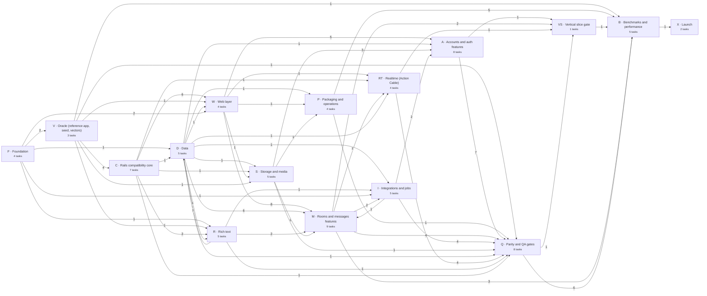

# C# port task DAG

Generated by `plans/bin/plan dag` from [tasks.yaml](tasks.yaml). Don't edit by hand.

79 tasks in 16 lanes and 6 milestones. Nodes are grouped by milestone and labelled with size
(S ≈ ½ agent-day, M ≈ 1, L ≈ 2). Pink edges and borders are the critical path; yellow nodes are on
the path to the five README benchmark workloads.

## Lane overview

Edge labels count the task-level dependencies between lanes.

## Full task graph

```mermaid
flowchart LR
  subgraph M0["M0 · Foundation"]
    direction TB
    F01["F01 Restructure repo around pinned references<br/><small>S</small>"]
    F02["F02 Scaffold the .NET solution<br/><small>M</small>"]
    F03["F03 CI and agent dev environment<br/><small>S</small>"]
    F04["F04 Frontend assets and importmap, byte for byte<br/><small>M</small>"]
    V01["V01 Reference app runner in production mode<br/><small>M</small>"]
    V02["V02 Shared parity and benchmark seed<br/><small>S</small>"]
    V03["V03 Golden vectors and C#35; loader<br/><small>M</small>"]
    C01["C01 Rails crypto primitives<br/><small>M</small>"]
    C06["C06 Ruby and ActiveSupport formatting helpers<br/><small>M</small>"]
    D01["D01 SQLite infrastructure<br/><small>M</small>"]
    W04["W04 Erubi-compatible template compiler<br/><small>L</small>"]
  end
  subgraph M1["M1 · Vertical slice"]
    direction TB
    C02["C02 Cookie jar, session store and flash<br/><small>M</small>"]
    C03["C03 CSRF protection<br/><small>M</small>"]
    C04["C04 Signed IDs, GlobalID/SGID, Turbo stream names<br/><small>M</small>"]
    C05["C05 Rails params parser<br/><small>M</small>"]
    C07["C07 Browser and platform detection<br/><small>S</small>"]
    D02["D02 Domain records and queries<br/><small>L</small>"]
    D03["D03 Lifecycle callbacks and domain event seams<br/><small>M</small>"]
    D05["D05 Message pagination<br/><small>S</small>"]
    R01["R01 Nokogiri-compatible HTML parse and serialize<br/><small>L</small>"]
    R02["R02 Sanitizer pipeline<br/><small>L</small>"]
    R03["R03 Attachment rendering - mentions and embeds<br/><small>M</small>"]
    R05["R05 Plain text and edit round trip<br/><small>M</small>"]
    S01["S01 Active Storage core<br/><small>M</small>"]
    S02["S02 Variant keys and representation URLs<br/><small>M</small>"]
    W01["W01 Ordered router, full route table and URL helpers<br/><small>L</small>"]
    W02["W02 Controller pipeline and Current<br/><small>L</small>"]
    W03["W03 Rails view helper library and layout<br/><small>L</small>"]
    A01["A01 First run, sign in/out, welcome<br/><small>M</small>"]
    M02["M02 Message rendering<br/><small>L</small>"]
    M03["M03 Room page<br/><small>M</small>"]
    M04["M04 Messages index, pagination and refresh<br/><small>M</small>"]
    M05["M05 Create, edit and delete messages<br/><small>L</small>"]
    RT01["RT01 Action Cable server<br/><small>L</small>"]
    RT02["RT02 Turbo streams channel and broadcasts<br/><small>M</small>"]
    P01["P01 Container image and CLI<br/><small>M</small>"]
    Q01["Q01 HTTP replay and normalized diff harness<br/><small>L</small>"]
    Q03["Q03 State differential and Rails-on-C#35;-data<br/><small>M</small>"]
    VS01["VS01 Vertical slice gate<br/><small>S</small>"]
    B01["B01 Benchmark harness integration<br/><small>M</small>"]
  end
  subgraph M2["M2 · Benchmark five"]
    direction TB
    D04["D04 Message search<br/><small>M</small>"]
    M01["M01 Sidebar<br/><small>M</small>"]
    M08["M08 Search pages<br/><small>M</small>"]
    B02["B02 First internal numbers for the five workloads<br/><small>S</small>"]
  end
  subgraph M3["M3 · Feature complete"]
    direction TB
    S05["S05 Active Storage HTTP endpoints<br/><small>M</small>"]
    S03["S03 Media processing<br/><small>L</small>"]
    S04["S04 QR code SVG<br/><small>S</small>"]
    A02["A02 Session transfers and profile<br/><small>S</small>"]
    A03["A03 Join, users, account settings, logo, custom styles<br/><small>M</small>"]
    A04["A04 Account user admin and bans<br/><small>M</small>"]
    A05["A05 Bots admin<br/><small>M</small>"]
    A06["A06 Avatars<br/><small>M</small>"]
    A07["A07 Push subscriptions UI<br/><small>S</small>"]
    A08["A08 PWA, QR, health and autocomplete<br/><small>M</small>"]
    M06["M06 Boosts<br/><small>S</small>"]
    M07["M07 Room CRUD, settings and involvement<br/><small>L</small>"]
    M09["M09 Link unfurling endpoint<br/><small>S</small>"]
    RT03["RT03 App channels, presence and unread fanout<br/><small>L</small>"]
    RT04["RT04 Revocation and disconnects<br/><small>M</small>"]
    I01["I01 In-process job runner<br/><small>S</small>"]
    I02["I02 Web Push<br/><small>L</small>"]
    I03["I03 Open Graph fetching<br/><small>M</small>"]
    I04["I04 Private network guard and restricted HTTP client<br/><small>S</small>"]
    I05["I05 Bot API and webhooks<br/><small>L</small>"]
    P02["P02 Pinned media toolchain in the image<br/><small>M</small>"]
    Q02["Q02 Route coverage gate<br/><small>M</small>"]
  end
  subgraph M4["M4 · Parity gates green"]
    direction TB
    R04["R04 Rich text gate and differential fuzzing<br/><small>M</small>"]
    P03["P03 Public front server<br/><small>L</small>"]
    P04["P04 Backup and restore hooks<br/><small>S</small>"]
    Q04["Q04 Screen parity<br/><small>L</small>"]
    Q05["Q05 Cable replay<br/><small>M</small>"]
    Q06["Q06 Cross-server continuity<br/><small>S</small>"]
    Q07["Q07 Ported system tests as Playwright workflows<br/><small>M</small>"]
    Q08["Q08 Security review<br/><small>M</small>"]
  end
  subgraph M5["M5 · Optimized, measured, published"]
    direction TB
    B03["B03 Performance round<br/><small>L</small>"]
    B04["B04 Runtime configuration matrix including Native AOT<br/><small>M</small>"]
    B05["B05 Final benchmark on reference-class hardware<br/><small>M</small>"]
    X01["X01 README, known differences and implementation record<br/><small>S</small>"]
    X02["X02 Upstream PR and announcement<br/><small>S</small>"]
  end
  F01 --> F02
  F02 --> F03
  F02 --> F04
  F01 --> V01
  V03 --> V01
  V01 --> V02
  F02 --> V03
  V03 --> C01
  C01 --> C02
  C02 --> C03
  C01 --> C04
  V03 --> C05
  V03 --> C06
  V03 --> C07
  F02 --> D01
  D01 --> D02
  C06 --> D02
  D02 --> D03
  D02 --> D04
  R05 --> D04
  D02 --> D05
  F02 --> R01
  V03 --> R01
  R01 --> R02
  C06 --> R02
  R02 --> R03
  C04 --> R03
  D02 --> R03
  R03 --> R05
  R05 --> R04
  D01 --> S01
  C04 --> S01
  S01 --> S05
  S02 --> S05
  W02 --> S05
  S01 --> S02
  S02 --> S03
  V03 --> S04
  C05 --> W01
  V03 --> W01
  W01 --> W02
  C03 --> W02
  C07 --> W02
  D02 --> W02
  W01 --> W03
  W04 --> W03
  F04 --> W03
  C03 --> W03
  C04 --> W03
  C06 --> W03
  F02 --> W04
  W02 --> A01
  W03 --> A01
  D03 --> A01
  A01 --> A02
  A01 --> A03
  S03 --> A03
  A03 --> A04
  I01 --> A04
  A03 --> A05
  S03 --> A06
  W03 --> A06
  A01 --> A07
  I02 --> A07
  W02 --> A08
  W03 --> A08
  S04 --> A08
  W02 --> M01
  W03 --> M01
  D02 --> M01
  R03 --> M02
  S02 --> M02
  W03 --> M02
  M02 --> M03
  D05 --> M03
  W02 --> M03
  M02 --> M04
  D05 --> M04
  W02 --> M04
  M02 --> M05
  R05 --> M05
  D03 --> M05
  W02 --> M05
  M05 --> M06
  M03 --> M07
  D03 --> M07
  D04 --> M08
  M02 --> M08
  W02 --> M08
  I03 --> M09
  W02 --> M09
  W02 --> RT01
  RT01 --> RT02
  C04 --> RT02
  M02 --> RT02
  RT02 --> RT03
  D03 --> RT03
  RT03 --> RT04
  D03 --> I01
  I01 --> I02
  I04 --> I02
  I04 --> I03
  R01 --> I03
  F02 --> I04
  M05 --> I05
  M06 --> I05
  I01 --> I05
  D01 --> P01
  W01 --> P01
  P01 --> P02
  S03 --> P02
  P01 --> P03
  P01 --> P04
  V02 --> Q01
  P01 --> Q01
  Q01 --> Q02
  A02 --> Q02
  A04 --> Q02
  A05 --> Q02
  A06 --> Q02
  A07 --> Q02
  A08 --> Q02
  M06 --> Q02
  M07 --> Q02
  M08 --> Q02
  M09 --> Q02
  I05 --> Q02
  S05 --> Q02
  Q01 --> Q03
  D03 --> Q03
  Q02 --> Q04
  RT04 --> Q04
  RT04 --> Q05
  Q01 --> Q05
  Q01 --> Q06
  A02 --> Q06
  Q02 --> Q07
  RT04 --> Q07
  R04 --> Q08
  RT04 --> Q08
  I02 --> Q08
  I03 --> Q08
  I05 --> Q08
  C03 --> Q08
  A01 --> VS01
  M03 --> VS01
  M05 --> VS01
  RT02 --> VS01
  Q03 --> VS01
  V02 --> B01
  P01 --> B01
  B01 --> B02
  VS01 --> B02
  M01 --> B02
  M04 --> B02
  M08 --> B02
  Q01 --> B02
  B02 --> B03
  Q02 --> B03
  B02 --> B04
  P01 --> B04
  B03 --> B05
  B04 --> B05
  Q04 --> B05
  Q05 --> B05
  Q07 --> B05
  Q08 --> B05
  P02 --> B05
  P03 --> B05
  P04 --> B05
  B05 --> X01
  X01 --> X02
  linkStyle 0,6,22,23,25,70,79,83,105,126,158,161,170,171 stroke:#d6336c,stroke-width:3px
  style M0 fill:transparent,stroke:#adb5bd,stroke-dasharray:4 3
  style M1 fill:transparent,stroke:#adb5bd,stroke-dasharray:4 3
  style M2 fill:transparent,stroke:#adb5bd,stroke-dasharray:4 3
  style M3 fill:transparent,stroke:#adb5bd,stroke-dasharray:4 3
  style M4 fill:transparent,stroke:#adb5bd,stroke-dasharray:4 3
  style M5 fill:transparent,stroke:#adb5bd,stroke-dasharray:4 3
  classDef bench fill:#fff3bf,stroke:#f08c00,color:#000
  classDef critical stroke:#d6336c,stroke-width:3px
  classDef done fill:#d3f9d8,stroke:#2f9e44,color:#000
  class D04,D05,R03,S01,S02,W01,W02,W03,A01,M01,M02,M03,M04,M05,M08,VS01,B01,B02 bench
  class F01,F02,V03,R01,R02,R03,M02,M05,M06,I05,Q02,B03,B05,X01,X02 critical
```

## Critical path

Weighted length 38 (S=1, M=2, L=4), about 19.0 days of strictly sequential work:

`F01` → `F02` → `V03` → `R01` → `R02` → `R03` → `M02` → `M05` → `M06` → `I05` → `Q02` → `B03` → `B05` → `X01` → `X02`

**Path to first benchmark numbers (B02)**, about 12.5 days:

`F01` → `F02` → `V03` → `R01` → `R02` → `R03` → `M02` → `M05` → `VS01` → `B02`

## Waves

A task's wave is the length of its longest dependency chain. Every task in a wave can run in
parallel once the previous waves are done; in practice `plans/bin/plan ready` starts each task as
soon as its own dependencies are done, without waiting for the whole wave.

| Wave | Width | Tasks |
|---:|---:|---|
| 0 | 1 | `F01` |
| 1 | 1 | `F02` |
| 2 | 6 | `D01` `F03` `F04` `I04` `V03` `W04` |
| 3 | 7 | `C01` `C05` `C06` `C07` `R01` `S04` `V01` |
| 4 | 7 | `C02` `C04` `D02` `I03` `R02` `V02` `W01` |
| 5 | 6 | `C03` `D03` `D05` `P01` `R03` `S01` |
| 6 | 9 | `B01` `I01` `P03` `P04` `Q01` `R05` `S02` `W02` `W03` |
| 7 | 12 | `A01` `A08` `D04` `I02` `M01` `M02` `M09` `Q03` `R04` `RT01` `S03` `S05` |
| 8 | 10 | `A02` `A03` `A06` `A07` `M03` `M04` `M05` `M08` `P02` `RT02` |
| 9 | 7 | `A04` `A05` `M06` `M07` `Q06` `RT03` `VS01` |
| 10 | 3 | `B02` `I05` `RT04` |
| 11 | 4 | `B04` `Q02` `Q05` `Q08` |
| 12 | 3 | `B03` `Q04` `Q07` |
| 13 | 1 | `B05` |
| 14 | 1 | `X01` |
| 15 | 1 | `X02` |

## Swarm sizing

List scheduling by critical-path priority, assuming each task takes its nominal size and merges
immediately. Real throughput will be lower: review, integration and rework aren't modelled.

| Agents | Calendar days to finish | Peak parallel |
|---:|---:|---:|
| 1 | 89.0 | 1 |
| 4 | 25.0 | 4 |
| 8 | 19.0 | 8 |
| 12 | 19.0 | 12 |
| 16 | 19.0 | 12 |

Total work: 89.0 agent-days.

## Task index

| ID | Task | Lane | Milestone | Size | Depends on |
|---|---|---|---|---|---|
| `F01` | Restructure repo around pinned references | F | M0 | S |  |
| `F02` | Scaffold the .NET solution | F | M0 | M | `F01` |
| `D01` | SQLite infrastructure | D | M0 | M | `F02` |
| `F03` | CI and agent dev environment | F | M0 | S | `F02` |
| `F04` | Frontend assets and importmap, byte for byte | F | M0 | M | `F02` |
| `I04` | Private network guard and restricted HTTP client | I | M3 | S | `F02` |
| `V03` | Golden vectors and C# loader | V | M0 | M | `F02` |
| `W04` | Erubi-compatible template compiler | W | M0 | L | `F02` |
| `C01` | Rails crypto primitives | C | M0 | M | `V03` |
| `C05` | Rails params parser | C | M1 | M | `V03` |
| `C06` | Ruby and ActiveSupport formatting helpers | C | M0 | M | `V03` |
| `C07` | Browser and platform detection | C | M1 | S | `V03` |
| `R01` | Nokogiri-compatible HTML parse and serialize | R | M1 | L | `F02` `V03` |
| `S04` | QR code SVG | S | M3 | S | `V03` |
| `V01` | Reference app runner in production mode | V | M0 | M | `F01` `V03` |
| `C02` | Cookie jar, session store and flash | C | M1 | M | `C01` |
| `C04` | Signed IDs, GlobalID/SGID, Turbo stream names | C | M1 | M | `C01` |
| `D02` | Domain records and queries | D | M1 | L | `D01` `C06` |
| `I03` | Open Graph fetching | I | M3 | M | `I04` `R01` |
| `R02` | Sanitizer pipeline | R | M1 | L | `R01` `C06` |
| `V02` | Shared parity and benchmark seed | V | M0 | S | `V01` |
| `W01` | Ordered router, full route table and URL helpers ⚡ | W | M1 | L | `C05` `V03` |
| `C03` | CSRF protection | C | M1 | M | `C02` |
| `D03` | Lifecycle callbacks and domain event seams | D | M1 | M | `D02` |
| `D05` | Message pagination ⚡ | D | M1 | S | `D02` |
| `P01` | Container image and CLI | P | M1 | M | `D01` `W01` |
| `R03` | Attachment rendering - mentions and embeds ⚡ | R | M1 | M | `R02` `C04` `D02` |
| `S01` | Active Storage core ⚡ | S | M1 | M | `D01` `C04` |
| `B01` | Benchmark harness integration ⚡ | B | M1 | M | `V02` `P01` |
| `I01` | In-process job runner | I | M3 | S | `D03` |
| `P03` | Public front server | P | M4 | L | `P01` |
| `P04` | Backup and restore hooks | P | M4 | S | `P01` |
| `Q01` | HTTP replay and normalized diff harness | Q | M1 | L | `V02` `P01` |
| `R05` | Plain text and edit round trip | R | M1 | M | `R03` |
| `S02` | Variant keys and representation URLs ⚡ | S | M1 | M | `S01` |
| `W02` | Controller pipeline and Current ⚡ | W | M1 | L | `W01` `C03` `C07` `D02` |
| `W03` | Rails view helper library and layout ⚡ | W | M1 | L | `W01` `W04` `F04` `C03` `C04` `C06` |
| `A01` | First run, sign in/out, welcome ⚡ | A | M1 | M | `W02` `W03` `D03` |
| `A08` | PWA, QR, health and autocomplete | A | M3 | M | `W02` `W03` `S04` |
| `D04` | Message search ⚡ | D | M2 | M | `D02` `R05` |
| `I02` | Web Push | I | M3 | L | `I01` `I04` |
| `M01` | Sidebar ⚡ | M | M2 | M | `W02` `W03` `D02` |
| `M02` | Message rendering ⚡ | M | M1 | L | `R03` `S02` `W03` |
| `M09` | Link unfurling endpoint | M | M3 | S | `I03` `W02` |
| `Q03` | State differential and Rails-on-C#-data | Q | M1 | M | `Q01` `D03` |
| `R04` | Rich text gate and differential fuzzing | R | M4 | M | `R05` |
| `RT01` | Action Cable server | RT | M1 | L | `W02` |
| `S03` | Media processing | S | M3 | L | `S02` |
| `S05` | Active Storage HTTP endpoints | S | M3 | M | `S01` `S02` `W02` |
| `A02` | Session transfers and profile | A | M3 | S | `A01` |
| `A03` | Join, users, account settings, logo, custom styles | A | M3 | M | `A01` `S03` |
| `A06` | Avatars | A | M3 | M | `S03` `W03` |
| `A07` | Push subscriptions UI | A | M3 | S | `A01` `I02` |
| `M03` | Room page ⚡ | M | M1 | M | `M02` `D05` `W02` |
| `M04` | Messages index, pagination and refresh ⚡ | M | M1 | M | `M02` `D05` `W02` |
| `M05` | Create, edit and delete messages ⚡ | M | M1 | L | `M02` `R05` `D03` `W02` |
| `M08` | Search pages ⚡ | M | M2 | M | `D04` `M02` `W02` |
| `P02` | Pinned media toolchain in the image | P | M3 | M | `P01` `S03` |
| `RT02` | Turbo streams channel and broadcasts | RT | M1 | M | `RT01` `C04` `M02` |
| `A04` | Account user admin and bans | A | M3 | M | `A03` `I01` |
| `A05` | Bots admin | A | M3 | M | `A03` |
| `M06` | Boosts | M | M3 | S | `M05` |
| `M07` | Room CRUD, settings and involvement | M | M3 | L | `M03` `D03` |
| `Q06` | Cross-server continuity | Q | M4 | S | `Q01` `A02` |
| `RT03` | App channels, presence and unread fanout | RT | M3 | L | `RT02` `D03` |
| `VS01` | Vertical slice gate ⚡ | VS | M1 | S | `A01` `M03` `M05` `RT02` `Q03` |
| `B02` | First internal numbers for the five workloads ⚡ | B | M2 | S | `B01` `VS01` `M01` `M04` `M08` `Q01` |
| `I05` | Bot API and webhooks | I | M3 | L | `M05` `M06` `I01` |
| `RT04` | Revocation and disconnects | RT | M3 | M | `RT03` |
| `B04` | Runtime configuration matrix including Native AOT | B | M5 | M | `B02` `P01` |
| `Q02` | Route coverage gate | Q | M3 | M | `Q01` `A02` `A04` `A05` `A06` `A07` `A08` `M06` `M07` `M08` `M09` `I05` `S05` |
| `Q05` | Cable replay | Q | M4 | M | `RT04` `Q01` |
| `Q08` | Security review | Q | M4 | M | `R04` `RT04` `I02` `I03` `I05` `C03` |
| `B03` | Performance round | B | M5 | L | `B02` `Q02` |
| `Q04` | Screen parity | Q | M4 | L | `Q02` `RT04` |
| `Q07` | Ported system tests as Playwright workflows | Q | M4 | M | `Q02` `RT04` |
| `B05` | Final benchmark on reference-class hardware | B | M5 | M | `B03` `B04` `Q04` `Q05` `Q07` `Q08` `P02` `P03` `P04` |
| `X01` | README, known differences and implementation record | X | M5 | S | `B05` |
| `X02` | Upstream PR and announcement | X | M5 | S | `X01` |

⚡ on the path to the five benchmark workloads.
